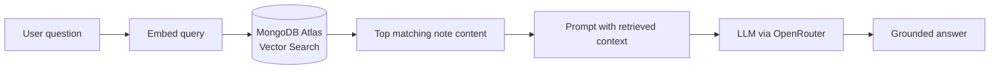
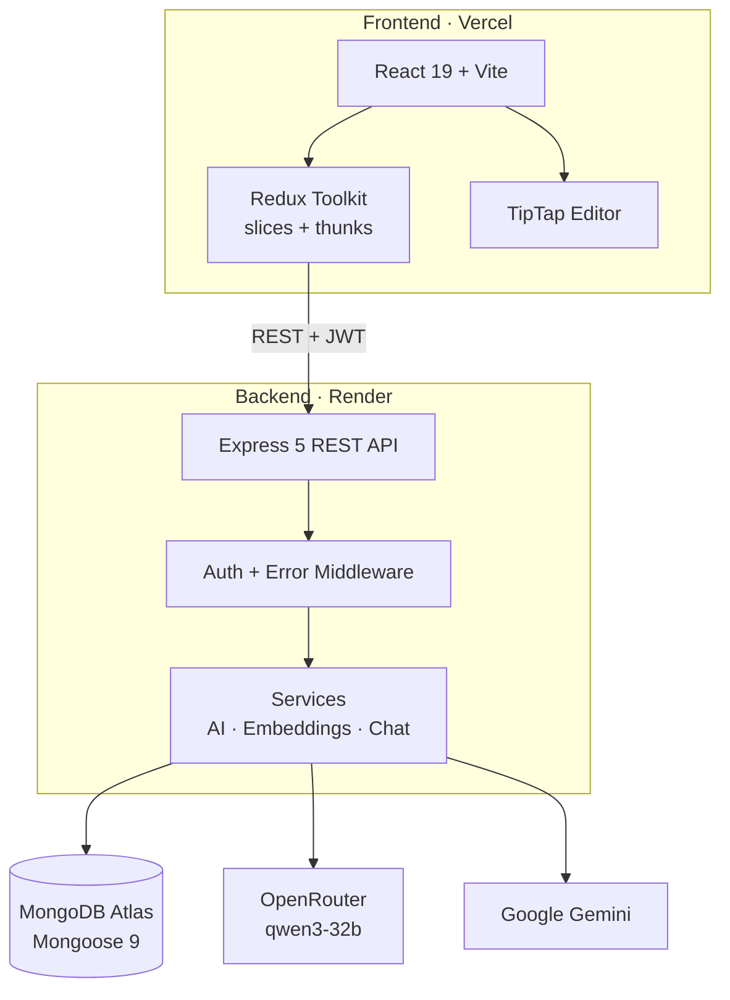

<div align="center">

# Noto

**AI-powered note-taking with spaced repetition and RAG**

Write structured notes, turn them into flashcards and quizzes, and chat with an AI tutor that answers from *your own content*.

[](https://noto-rust.vercel.app)
[](https://noto-1-qwzb.onrender.com)
[](#license)

[](https://react.dev/)
[](https://vitejs.dev/)
[](https://tailwindcss.com/)
[](https://redux-toolkit.js.org/)
[](https://nodejs.org/)
[](https://expressjs.com/)
[](https://www.mongodb.com/products/platform/atlas-vector-search)

[**Live Demo**](https://noto-rust.vercel.app) · [**API**](https://noto-1-qwzb.onrender.com) · [**Report a Bug**](https://github.com/Md-Zaid45/Noto/issues)

</div>

---

<!--
  ADD SCREENSHOTS HERE (highest-impact change for recruiters).
  Save images to docs/screenshots/ and uncomment:

  <p align="center">
    
    
  </p>
  <p align="center">
    
    
  </p>
-->

## Overview

Most note apps stop at storing text. Noto closes the loop between **capturing** and **remembering**: every note can be converted into flashcards and quizzes, reviewed on a spaced-repetition schedule, and queried through an AI tutor that retrieves context from your own notes rather than answering from generic training data.

## Features

### Notes & Organization
- **Rich text editor** built on TipTap (ProseMirror) with a formatting toolbar, multi-tab editing, and auto-save
- **Folder hierarchy** with tree navigation and context menus (rename, delete, move)
- **Dark mode** that follows the system theme, with a manual toggle

### Active Recall
- **AI-generated flashcards** created from the content of your notes
- **Quiz generation** with multiple-choice questions and explanations
- **SM-2 spaced repetition** that adjusts review intervals based on how well you recall each card

### AI Tutor
- **RAG chat** scoped to a single note or across your whole library, using vector search for retrieval
- **Note summarization** in brief, detailed, or bullet-point formats

### Security
- **JWT authentication** with short-lived access tokens and refresh tokens
- **Protected routes** and **per-user data isolation** across all resources

## How It Works



1. Note content is embedded and stored in MongoDB Atlas alongside the note.
2. When you ask a question, the query is embedded and matched against your notes using Atlas Vector Search.
3. The most relevant passages are injected into the prompt, so answers are grounded in what you actually wrote.
4. The same content powers flashcard, quiz, and summary generation.

## Architecture



### Engineering Highlights
- **Feature-based frontend structure**, with each domain (`auth`, `notes`, `folders`, `flashcards`, `navigation`) owning its components, slices, and thunks
- **Layered backend** separating routes, controllers, services, and models, so AI and embedding logic stays independent of HTTP handling
- **Centralized error handling** through a custom `ApiError` class and error middleware
- **Structured JSON logging** with Pino across the full RAG pipeline for easier debugging and observability
- **Token-based auth** with access/refresh flow and per-user data scoping on every query

## Tech Stack

| Layer | Technology |
|---|---|
| **Frontend** | React 19, Vite 7, TailwindCSS 4 |
| **State** | Redux Toolkit (slices + thunks) |
| **Editor** | TipTap (ProseMirror) |
| **UI** | Radix UI, Lucide Icons |
| **Backend** | Node.js, Express 5 |
| **Database** | MongoDB, Mongoose 9, Atlas Vector Search |
| **AI** | OpenRouter (qwen3-32b), Google Gemini |
| **Auth** | JWT (access + refresh tokens) |
| **Logging** | Pino |
| **Deployment** | Vercel (frontend), Render (backend) |

## Project Structure

```
Noto/
├── frontend/
│   └── src/
│       ├── features/
│       │   ├── auth/           # Login, signup, hooks, thunks
│       │   ├── flashcards/     # Review cards, scheduling, slices
│       │   ├── folders/        # Folder tree, Redux slice, thunks
│       │   ├── navigation/     # Header, sidebar, activity bar
│       │   └── notes/          # Editor, tabs, content slices
│       ├── pages/              # Route-level components
│       ├── store/              # Redux store config
│       └── commons/            # Shared components, loaders
└── backend/
    └── src/
        ├── controllers/        # Route handlers
        ├── models/             # Mongoose schemas
        ├── services/           # AI, embeddings, chat logic
        ├── routes/             # Express route definitions
        ├── middlewares/        # Auth, error handling
        └── utils/              # ApiError, logger
```

## Getting Started

### Prerequisites

- Node.js 20+
- MongoDB Atlas cluster (required for vector search) or a local MongoDB instance for non-AI features
- OpenRouter API key (chat and summaries)
- Google Gemini API key (flashcards and quizzes)

### Installation

```bash
git clone https://github.com/Md-Zaid45/Noto.git
cd Noto
```

**1. Backend**

```bash
cd backend
npm install
cp .env.example .env   # then fill in your values
npm run dev
```

Example `.env`:

```env
MONGO_DB_URI=mongodb://localhost:27017/noto
ACCESS_TOKEN_SECRET=<random-64-char-string>
ACCESS_TOKEN_EXPIRY=15m
REFRESH_TOKEN_SECRET=<random-64-char-string>
REFRESH_TOKEN_EXPIRY=7d
OPENROUTER_API_KEY=your-openrouter-key
GEMINI_API_KEY=your-gemini-key
ORIGIN=http://localhost:5173
MODEL=qwen/qwen3-32b
LOG_LEVEL=info
```

**2. Frontend**

```bash
cd frontend
npm install
npm run dev
```

Open [http://localhost:5173](http://localhost:5173).

## Environment Variables

| Variable | Description | Required |
|---|---|---|
| `MONGO_DB_URI` | MongoDB connection string | Yes |
| `ACCESS_TOKEN_SECRET` | Secret for signing access tokens | Yes |
| `ACCESS_TOKEN_EXPIRY` | Access token lifetime (e.g. `15m`) | Yes |
| `REFRESH_TOKEN_SECRET` | Secret for signing refresh tokens | Yes |
| `REFRESH_TOKEN_EXPIRY` | Refresh token lifetime (e.g. `7d`) | Yes |
| `OPENROUTER_API_KEY` | OpenRouter key for chat and summaries | For AI chat |
| `GEMINI_API_KEY` | Google Gemini key | For flashcards and quizzes |
| `ORIGIN` | Frontend URL, used for CORS | Yes |
| `MODEL` | Chat model (default: `qwen/qwen3-32b`) | No |
| `LOG_LEVEL` | `debug` / `info` / `warn` / `error` | No |

## API Reference

All routes are prefixed with `/api/v1`. Every route except signup and login requires a valid access token.

<details>
<summary><b>Auth</b></summary>

| Method | Endpoint | Description |
|---|---|---|
| POST | `/users/signup` | Create account |
| POST | `/users/login` | Log in |
| POST | `/users/logout` | Log out |
| POST | `/users/refresh-token` | Refresh access token |

</details>

<details>
<summary><b>Notes</b></summary>

| Method | Endpoint | Description |
|---|---|---|
| POST | `/notes/` | Create note |
| GET | `/notes/:id` | Get note with content |
| PATCH | `/notes/:id` | Update note name |
| DELETE | `/notes/:id` | Delete note |
| POST | `/notes/:id/content` | Add content block |
| PATCH | `/notes/content/:id` | Update content block |
| DELETE | `/notes/content/:id` | Delete content block |

</details>

<details>
<summary><b>Folders</b></summary>

| Method | Endpoint | Description |
|---|---|---|
| POST | `/folders/` | Create folder |
| PATCH | `/folders/:id` | Rename folder |
| DELETE | `/folders/:id` | Delete folder |

</details>

<details>
<summary><b>AI</b></summary>

| Method | Endpoint | Description |
|---|---|---|
| POST | `/ai/chat/:id?` | RAG chat (note-scoped when `id` is given, otherwise global) |
| POST | `/ai/summary/:id` | Summarize a note |
| POST | `/ai/flashcards/:id` | Generate flashcards |
| POST | `/ai/quiz/:id` | Generate a quiz |

</details>

## Deployment

| Service | Platform |
|---|---|
| Frontend | [Vercel](https://vercel.com) |
| Backend | [Render](https://render.com) |
| Database | [MongoDB Atlas](https://www.mongodb.com/atlas) |

## Author

**Moh Zaid Khan**

[](https://github.com/Md-Zaid45)
<!-- [](https://linkedin.com/in/your-handle) -->
<!-- [](https://your-site.com) -->

## License

Released under the [MIT License](LICENSE).